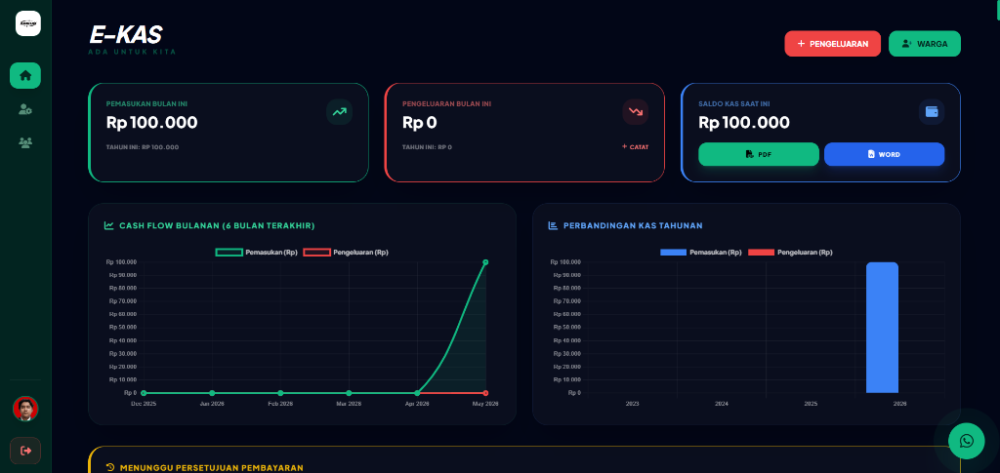
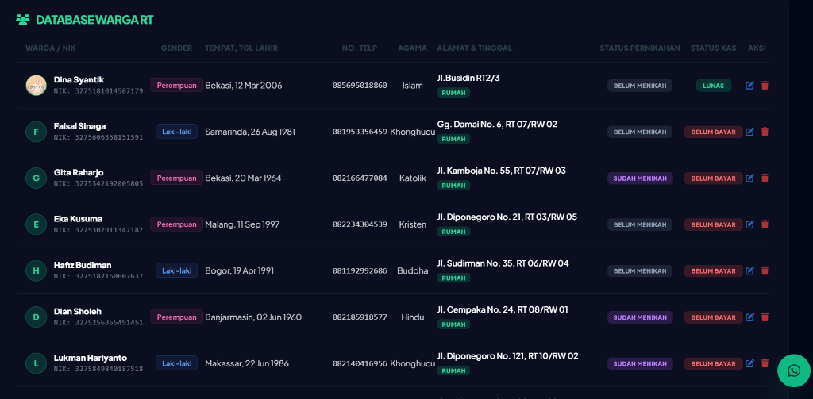
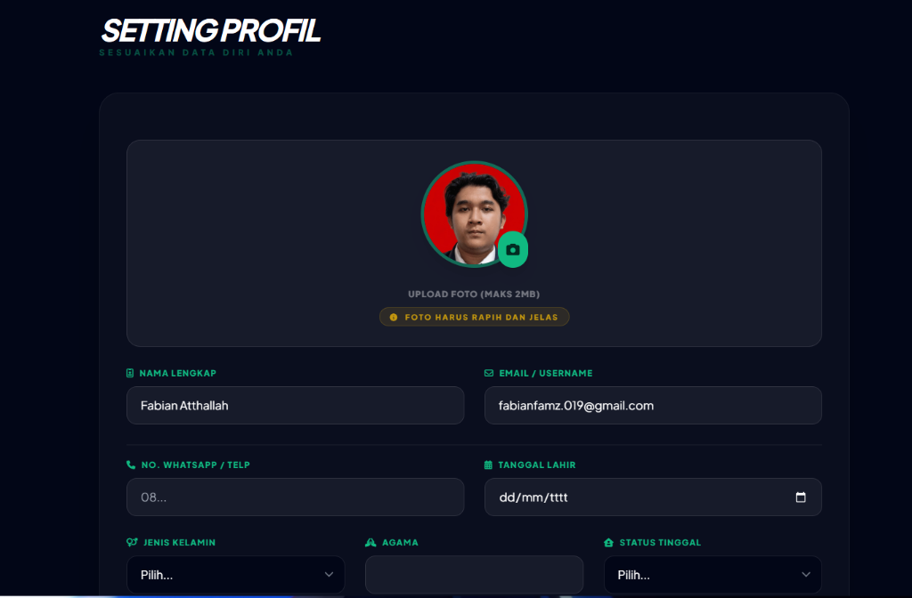
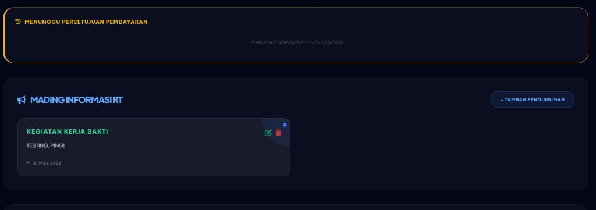

# 🟢 E-KAS RT - Sistem Pengelolaan Kas Rukun Tetangga Premium (Beta)

<p align="center">
  
</p>

<p align="center">
  <strong>E-KAS RT</strong> adalah platform pengelolaan keuangan kas Rukun Tetangga (RT) modern berbasis web yang dirancang dengan antarmuka <strong>Emerald Dark Glassmorphism</strong> yang futuristik, dinamis, dan sangat responsif. Aplikasi ini memudahkan pengurus RT (Admin & Bendahara) dalam mengelola data warga, mencatat iuran masuk, menyetujui transaksi pembayaran, mencatat pengeluaran secara terpusat, serta memberikan visualisasi data kas yang komprehensif bagi warga secara transparan.
</p>

<p align="center">
  
  
  
  
</p>

---

## 📷 Tangkapan Layar (Screenshots Showcase)

Berikut adalah visualisasi antarmuka premium dari platform **E-KAS RT**:

### 1. Dashboard Utama & Analitik Kas Real-Time
Menampilkan total pemasukan, pengeluaran, saldo kas, serta grafik arus kas bulanan (Line Chart) dan perbandingan tahunan (Bar Chart) menggunakan Chart.js. Dilengkapi dengan tombol ekspor PDF & Word.
<p align="center">
  
</p>

### 2. Database Warga Terperinci (Tampilan Desktop)
Pencatatan data identitas warga secara menyeluruh dengan kolom terstruktur rapi tanpa scroll menyamping.
<p align="center">
  
</p>

### 3. Pengaturan Profil Mandiri
Formulir dinamis bagi warga dan admin untuk mengubah data pribadi, mengunggah foto profil, dan menyelaraskan status tempat tinggal secara langsung.
<p align="center">
  
</p>

### 4. Mading Informasi & Persetujuan Kas (Admin & Bendahara)
Panel terpusat untuk memposting pengumuman warga di mading informasi RT dan memvalidasi pembayaran iuran warga berdasarkan bukti transfer.
<p align="center">
  
</p>

---

## ✨ Fitur-Fitur Utama

*   📈 **Dashboard Finansial Ekssekutif**: Ringkasan kas otomatis yang menyinkronkan data pemasukan dan pengeluaran secara real-time.
*   📊 **Grafik Cash Flow Interaktif**: Visualisasi arus kas dengan Chart.js yang dinamis untuk melihat tren pemasukan vs pengeluaran (Bulan & Tahun).
*   📱 **Laci Warga Interaktif (Responsive Mobile View)**: Desain khusus mobile di mana tabel database warga yang lebar secara otomatis disembunyikan dan digantikan oleh deretan kartu laci (*accordion drawers*) mewah.
    *   **Simulasi Hover**: Mengarahkan kursor ke kartu warga langsung melebarkan laci detail secara mulus.
    *   **Sentuhan Mobile (Tap)**: Mengetuk kartu warga membuka detail secara eksklusif dan otomatis menutup laci warga lainnya.
*   💬 **Widget Layanan Pelanggan WhatsApp (Beta Widget)**: Tombol WhatsApp terapung berdenyut di pojok bawah kanan yang menampilkan popover masukan/kritik/kendala fase Beta, dan langsung menghubungkan pengguna ke WhatsApp Admin dengan pesan otomatis.
*   📄 **Ekspor Laporan Cepat**: Cetak laporan rekap kas bulanan secara instan dalam format **PDF** dan **Microsoft Word**.
*   📢 **Mading Informasi RT**: Papan pengumuman warga interaktif yang dapat dikelola secara CRUD oleh admin/bendahara untuk mempublikasikan agenda RT (e.g., Kerja Bakti).
*   🔒 **Multi-Role Authentication**: Mendukung tiga peran pengguna dengan hak akses terproteksi: **Ketua RT (Admin)**, **Bendahara**, dan **Warga**.
*   🔔 **Sistem Validasi Pembayaran**: Warga dapat mengunggah bukti transfer, dan Admin/Bendahara memiliki wewenang untuk menyetujui (*Approve*) atau menolak (*Reject*) pembayaran tersebut.

---

## 🛠️ Teknologi yang Digunakan

*   **Framework Utama**: [Laravel 10.x (PHP 8.x)](https://laravel.com)
*   **Desain UI & Styling**: [Tailwind CSS 3.x](https://tailwindcss.com), Custom Glassmorphic CSS
*   **Interaktivitas & Efek**: Javascript (ES6), [SweetAlert2](https://sweetalert2.github.io), [Chart.js](https://www.chartjs.org)
*   **Font & Ikon**: Google Fonts (Plus Jakarta Sans), FontAwesome v6
*   **Sistem Database**: MySQL

---

## 🔑 Akun Uji Coba Default (Seeders)

Jalankan Database Seeder untuk mendapatkan akun bawaan berikut guna melakukan pengujian fungsionalitas:

| Peran (Role) | Email Login | Password | Akses & Wewenang |
| :--- | :--- | :--- | :--- |
| **Ketua RT (Admin)** | `admin@kasrt.id` | `123123123` | CRUD Warga, CRUD Mading, Catat Pengeluaran, Laporan Kas, Laporan Cetak, Approval Pembayaran |
| **Bendahara** | `bendahara@kasrt.id` | `123123123` | CRUD Warga, CRUD Mading, Catat Pengeluaran, Laporan Kas, Laporan Cetak, Approval Pembayaran |
| **Warga** | `warga@kasrt.id` | `123123123` | Ubah Profil Mandiri, Kirim Bukti Transfer Iuran, Lihat Dompet & Riwayat Pembayaran Pribadi |

---

## 🚀 Panduan Menjalankan Aplikasi

Ikuti langkah-langkah di bawah ini untuk memasang dan menjalankan proyek **E-KAS RT** di lingkungan lokal Anda:

### Prasyarat (Prerequisites)
Pastikan Anda sudah menginstal:
*   PHP >= 8.1
*   Composer
*   Node.js & NPM
*   MySQL Server (e.g., via Laragon, XAMPP, atau MySQL native)

### Langkah 1: Kloning & Masuk ke Proyek
```bash
git clone <url-repositori-anda>
cd fabiannproject
```

### Langkah 2: Instalasi Dependensi PHP & Javascript
Instal seluruh library backend Laravel dan aset frontend:
```bash
# Instal dependensi composer (PHP)
composer install

# Instal dependensi NPM (JS/CSS)
npm install
```

### Langkah 3: Konfigurasi Environment (`.env`)
Salin file konfigurasi contoh dan buat key aplikasi:
```bash
cp .env.example .env
php artisan key:generate
```
Buka berkas `.env` yang baru dibuat di editor Anda, lalu sesuaikan koneksi database Anda (berikut adalah konfigurasi standar jika Anda menggunakan Laragon & HeidiSQL):
```env
DB_CONNECTION=mysql
DB_HOST=127.0.0.1
DB_PORT=3306
DB_DATABASE=kas_rt
DB_USERNAME=root
DB_PASSWORD=
```

### Langkah 4: Migrasi & Seeding Database
Buat tabel database beserta akun bawaan (Ketua RT, Bendahara, dan Warga):
```bash
# Membuat skema tabel
php artisan migrate

# Mengisi data awal uji coba
php artisan db:seed --class=UserSeeder
```

### Langkah 5: Hubungkan Link Penyimpanan Media (Foto Profil)
Laravel memerlukan link simbolis agar berkas unggahan publik (seperti foto profil warga atau bukti transfer) dapat diakses dengan aman:
```bash
php artisan storage:link
```

### Langkah 6: Kompilasi Aset Frontend
Jalankan compiler Vite untuk memproses Tailwind CSS dan Javascript:
```bash
# Menjalankan Vite di mode development (Hot-reload)
npm run dev

# ATAU kompilasi final untuk mode production
npm run build
```

### Langkah 7: Jalankan Server Lokal
Jalankan server PHP artisan bawaan Laravel:
```bash
php artisan serve
```
Buka tautan [http://127.0.0.1:8000](http://127.0.0.1:8000) di browser Anda untuk masuk ke aplikasi.

---

## 📝 Catatan Tambahan (Pengembangan Beta)
Aplikasi saat ini dilengkapi dengan widget **Layanan Pelanggan WhatsApp (Beta)** di sudut bawah halaman. Nomor tujuan admin default diatur ke `082345678923`. Anda dapat mengubah nomor whatsapp admin sesungguhnya di bagian paling bawah berkas `resources/views/dashboard.blade.php` pada baris tautan `https://wa.me/6282345678923`.
